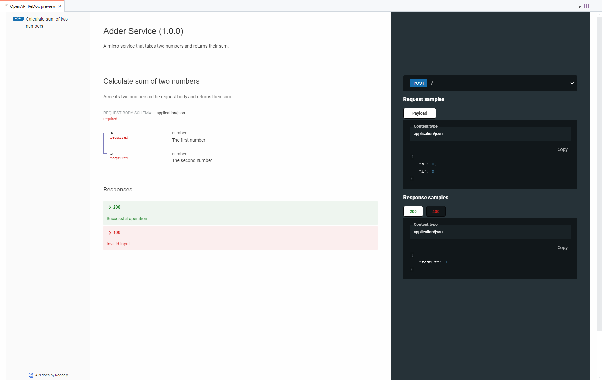

# Perfect Microservices

_Author_: **Botond János Kovács** (`botond.kovacs@siocode.hu`)

_Date_: **September, 2024**

_This readme contains the full text of the article. The entire source code created in the article is available in this repository as well._

# Disclaimer

This article revolves around _technical concepts_, and the possibility of _boilerplate code generation_. After initial reviews, we are fully aware, that the microservice architecture has _organizational and political reasons_ as well. This article **does not intend to address these reasons**, and focuses solely on the _technical aspects_ of microservices. Thank you for your understanding.

# Introduction

The microservice architecture is a common way to design and implement modern software systems. The main idea of microservices is to not only split up the system into _modules_, but rather into _completely independent processes_, that are communicating with each other _over the network_. It is being used to power many of the most popular web services, such as Netflix, but it does have its own challenges.

In this article, I am going to present a way to create applications, that utilize the microservice architecture. Not only that, but the specific focus of this article is to create **the best microservice architecture possible**, hence the title of the article.

Before diving deep into the technical details, let me first define what I mean when I say _"perfect microservices"_.

# What makes microservices perfect?

As I've previously mentioned, the microservice architecture comes with its own set of challenges. One thing we have to keep in mind is that software does _not only consist of code_. You may find different definitions of what "software" is, but in my mind software is the sum of _code_, _documentation_, _tests_, _configuration_ and _deployment_. To make our microservice architecture perfect, we have to address _all of these pieces of the software_.

* **Code** - We are going to create microservices using _Node.JS_, and _TypeScript_. More about this part of the stack later.
* **Documentation** - We are going to use a combination of _OpenAPI_ and _Markdown_ to create documentation for our microservices.
* **Tests** - We are going to use the good old _mocha + chai_ combination to write tests for our microservices.
* **Configuration** - To parse the config, we will utilize _dotenv_, but we also need to make sure that all of our configuration options are _documented_.
* **Deployment** - We are going to use _Docker_ to containerize our microservices, so that they can be easily deployed, for example to _Kubernetes_.

To make everything aligned, and achieve _harmony_ between these components, we are also going to add some _secret sauce_ to our project: a **code generator**. We are going to use [**ProJor**](https://projor.io) to generate as much as the code as possible, so that we can guarantee _single-source-of-truth_, and make sure, that the microservice nature of our application does _not actually introduce any unnecessary overhead_.

## More about the stack

Before diving deep into the coding, let me first elaborate on the tech stack, specifically the _code_ and _tests_ part.

In this article, we are creating **HTTP microservices**; you might also consider **gRPC**, **WebSocket**, **GraphQL** or other protocols, but for the sake of simplicity, we are going to stick with HTTP. We are going to use the _Express_ framework to create our microservices, and we are going to use _TypeScript_ to write our code.

We are also going to use the `esbuild` module bundler. A module bundler takes our _JS / TS code_, and spits out a _single merged JS file_, that can be run by Node.JS, without any further dependencies. I like `esbuild`, because it's easy to set up, and it is **lightning fast**.

The way I like laying out larger projects is to use the _monorepo pattern_, where each component we create is a _separate package_, residing in the same _git repository_. This allows common _dependency management_, and easier _full-stack development_. We'll use _npm_ to manage our packages.

In our monorepo, for each microservice we want to create a few different packages:

* We'll have the _service package_ itself, which contains the actual microservice implementation code.
* We'll have the _service client package_, which contains code to _call_ the microservice.
* We'll have the _service test package_, which contains the tests for the microservice. The test package will depend on the client package, so that writing tests is easier, supported by the IDE, and it is type-safe.

Alright, enough about talking about stuff, let's get to the coding part!

# Initial repository setup

Before doing anything else, we need to set up our monorepo. Let's create a new directory, and initialize a new git repository in it:

```bash
mkdir perfect-micro-services
cd perfect-micro-services
git init .
```

With that out of the way, we should now create a `package.json` file in the repository root directory. One particular thing about this `package.json` file is that we'll include the `workspaces` field in it, which will tell `npm` that we are using a monorepo. We are going to include **versioned dependencies** in this file, and we'll use the `*` version selector in sub-packages; this way, we ensure _harmonized dependency management_ across all of our packages. Here's the content of the `package.json` file:

```json
{
    "name": "perfect-micro-services",
    "version": "0.0.1",
    "private": true,
    "workspaces": [
        "packages/*"
    ],
    "dependencies": {
        "express": "4.19.2",
        "dotenv": "16.4.5"
    },
    "devDependencies": {
        "@types/node": "22.5.4",
        "@types/express": "4.17.21",
        "esbuild": "0.23.1",
        "typescript": "5.5.4"
    },
    "scripts": {}
}
```

Let's run `npm install` to install the dependencies.

Let's also add a `.gitignore` file to the repository root directory, with the following content:

```
node_modules/
```

Now we are ready to create **the first microservice**.

# The first microservice

Our first microservice will be called `adder-service`; when invoking it, we will provide two number parameters (`a` and `b`), and the service will calculate the sum of these numbers.

One key aspect to keep in mind when designing a microservice architecture is _request routing_. In this example, our microservices will be running on _different ports_. Later, we'll create an **API gateway**, that can route requests to the appropriate microservice based on the request path. Let's use ports in the range `3000-3999` for our microservices, so the first microservice will run on port `3000`. All microservices will serve **exactly one endpoint**, and the endpoint will be the root path `/`. We'll use the `POST` HTTP method with `Content-Type: application/json` for all of our requests.

First, let's create the `packages/` directory. We'll also create another directory inside this one, called `adder-service`. In this directory, we'll create a `package.json` file for the microservice package, with the following content:

```json
{
    "name": "adder-service",
    "version": "0.0.1",
    "private": true,
    "main": "dist/index.js",
    "scripts": {
        "build": "esbuild src/index.ts --bundle --minify --platform=node --outfile=dist/index.js",
        "start": "node dist/index.js"
    },
    "dependencies": {
        "express": "*",
        "dotenv": "*"
    },
    "devDependencies": {
        "@types/node": "*",
        "@types/express": "*",
        "esbuild": "*",
        "typescript": "*"
    }
}
```

I will also provide some explanation about the fields in this `package.json` file:

* The `build` script uses `esbuild` to build the `src/index.ts` file (our entrypoint) into `dist/index.js`.
* The `start` script runs the built `dist/index.js` file using Node.JS.
* We are using `*` as the version for all of the package's dependencies, so that we can ensure _harmonized dependency management_ across all of our packages. The actual used version will be the one we specified in the root `package.json` file.

Now let's create the `src/` directory inside the `adder-service` directory, and create an `index.ts` file in it. Let's start with the following content for our entrypoint:

```typescript
import dotenv from 'dotenv';
/* Load .env options into process.env */
dotenv.config();

import express from 'express';

/* The port the service will listen on (defaults to 3000) */
const PORT = parseInt(process.env.ADDER_SERVICE_PORT || '3000');

/* Create an Express app */
const app = express();

/* Set up middleware to parse JSON request bodies */
app.use(express.json());

/* Create the micro-service endpoint */
app.post('/', (req, res) => {

    /* See if request is valid */
    if (!req.body || typeof req.body.a !== 'number' || typeof req.body.b !== 'number') {
        res.status(400).json({ error: 'Invalid request' });
        return;
    }

    /* Calculate the sum */
    const { a, b } = req.body;
    const result = a + b;

    /* Send the result */
    res.json({ result });
});

/* Start the service */
app.listen(PORT, () => {
    console.log(`Adder Service listening on port ${PORT}`);
});
```

You might start seeing some red in your IDE, so we will also quickly fix that. The reason it is happening is that we haven't created a `tsconfig.json` file yet. Let's create the `packages/adder-service/tsconfig.json` file with the following content:

```json
{
    "compilerOptions": {
        "target": "ES2015",
        "module": "ES2015",
        "moduleResolution": "Node",
        "skipLibCheck": true,
        "allowSyntheticDefaultImports": true
    },
    "include": [
        "src/**/*.ts"
    ],
    "exclude": [
        "node_modules"
    ]
}
```

We can now quickly test if everything works so far:

* Let's build the microservice first, by running `npm run -w adder-service build` in the repository root directory, or running `npm run build` in the `adder-service` directory.

```
npm run -w adder-service build

> adder-service@0.0.1 build
> esbuild src/index.ts --bundle --minify --platform=node --outfile=dist/index.js


  dist\index.js  810.4kb

Done in 277ms
```

* Let's start the microservice by running `npm run -w adder-service start` in the repository root directory, or running `npm start` in the `adder-service` directory.

```
npm run -w adder-service start

> adder-service@0.0.1 start
> node dist/index.js

Adder Service listening on port 3000
```

* Let's send a request to the microservice using `curl`:

```bash
curl -X POST -H "Content-Type: application/json" -d '{"a": 1, "b": 2}' http://localhost:3000
```

If everything works, we should see the response `{"result":3}`.

Moving on, our next order of business is to create a simple _client library_ for this microservice, and write a _test_ for it.

## The first client and test

Let's create a new package in our mono-repo, called `adder-service-client`. Before writing all the files, allow me to explain some of the design decisions I made for this client package:

* The client package will be imported from _Node.JS code_, _Node.JS test code_ and possibly _browser code_. We will use _ES modules_ for the client.
* We will write the client package using _TypeScript_. Our build script will slightly differ, because for the client, we do not want to use a bundler. Instead, we are going to use the _TypeScript compiler_ to create JavaScript code, and also the _type declaratons_.
* Since we are using _Node.JS 20+_, native `fetch` is available, which means that the client package needs no dependencies.

Let's create the `packages/adder-service-client/package.json` file for this package, with the following content:

```json
{
    "name": "adder-service-client",
    "version": "0.0.1",
    "private": true,
    "type": "module",
    "main": "lib/index.js",
    "types": "types/index.d.ts",
    "scripts": {
        "build": "tsc"
    },
    "dependencies": {},
    "devDependencies": {
        "@types/node": "*",
        "esbuild": "*",
        "typescript": "*"
    }
}
```

Please note about this `package.json` file, that we _must_ specify `"type": "module"`. This will make sense once we get to the test part, this will be a requirement by `mocha`, the test framework.

We will also need to create a `packages/adder-service-client/tsconfig.json` file, which should A) compile our TS code into the `lib/` directory, and B) create TS declaration files in the `types/` directory:

```json
{
    "compilerOptions": {
        "target": "ES2015",
        "module": "ES2015",
        "moduleResolution": "Node",
        "declaration": true,
        "declarationDir": "types",
        "outDir": "lib",
        "skipLibCheck": true,
        "allowSyntheticDefaultImports": true
    },
    "include": [
        "src/**/*.ts"
    ],
    "exclude": [
        "node_modules"
    ]
}
```

Now all that's left is to create the `src/` directory inside the `adder-service-client` directory, and create an `index.ts` file in it. Let's start with the following content for our client:

```typescript
/**
 * The request object for the Adder Service.
 */
export interface IAdderServiceRequest {
    /**
     * The first number to add.
     */
    a: number;

    /**
     * The second number to add.
     */
    b: number;
}

/**
 * The response object for the Adder Service.
 */
export interface IAdderServiceResponse {
    /**
     * The result of the addition.
     */
    result: number;
}

/**
 * Interface for the Adder Service client.
 */
export interface IAdderServiceClient {
    call(request: IAdderServiceRequest): Promise<IAdderServiceResponse>;
}

/**
 * Implementation of the Adder Service client.
 */
class AdderServiceClientImpl implements IAdderServiceClient {

    private readonly baseUrl: string;

    constructor(baseUrl: string) {
        this.baseUrl = baseUrl;
    }

    async call(request: IAdderServiceRequest): Promise<IAdderServiceResponse> {
        const response = await fetch(this.baseUrl, {
            method: 'POST',
            headers: {
                'Content-Type': 'application/json'
            },
            body: JSON.stringify(request)
        });

        if (!response.ok) {
            throw new Error(`Adder Service returned status ${response.status}`);
        }

        return await response.json();
    }
}

/**
 * Factory function to create an instance of the Adder Service client.
 * @param baseUrl The base URL of the Adder Service.
 * @returns An instance of the Adder Service client.
 */
export function createAdderServiceClient(baseUrl: string): IAdderServiceClient {
    return new AdderServiceClientImpl(baseUrl);
}
```

Now, we can compile our client library by running `npm run -w adder-service-client build` in the repository root directory, or running `npm run build` in the `adder-service-client` directory. Once we did that, two new directories should appear in the `adder-service-client` directory: `lib/` and `types/`. The `lib/` directory contains the compiled JavaScript code, and the `types/` directory contains the TypeScript declaration files.

Now we can write a test for our client library. Let's create a new package in our mono-repo, called `adder-service-test`. We will use the `mocha` test runner, and the `chai` assertion library for our tests. Let's create the `packages/adder-service-test/package.json` file for this package, with the following content:

```json
{
    "name": "adder-service-test",
    "version": "0.0.1",
    "private": true,
    "type": "module",
    "scripts": {
        "start": "mocha src/**/*.test.js"
    },
    "dependencies": {
        "adder-service-client": "*"
    },
    "devDependencies": {
        "@types/mocha": "*",
        "mocha": "*",
        "chai": "*"
    }
}
```

Some notes about this `package.json` file that need a little bit of explanation:

* We must explicitly specify `"type": "module"` in the `package.json` file, because we are using ES modules in our test code. This is a requirement by `mocha`.
* We are including the `adder-service-client` dependency, which will be resolved from the workspace.
* The `start` script of this package will actually execute the tests we write in the `src/` directory. All test files should have the `.test.js` extension.

Alright, now we can write the test for our service! Let's create the `packages/adder-service-test/src/index.test.js` file, with the following content:

```javascript
import {
    createAdderServiceClient
} from "adder-service-client";
import { expect } from "chai";

describe('Adder Service', () => {

    const client = createAdderServiceClient(
        "http://127.0.0.1:3000"
    );

    it("should correctly add 1 + 2", async () => {

        const response = await client.call({
            a: 1,
            b: 2
        });

        // We should get a JS object
        expect(response).to.be.a("object");

        // The result should be 3
        expect(response.result).to.eq(3);

    })

});
```

Now we can run the test by executing `npm run -w adder-service-test start` in the repository root directory, or running `npm start` in the `adder-service-test` directory. If everything is set up correctly, the test should pass.

```
npm run -w adder-service-test start

> adder-service-test@0.0.1 start
> mocha src/**/*.test.js


  Adder Service
    ✔ should correctly add 1 + 2


  1 passing (37ms)
```

It is now time to move on to the next part of our journey: _containers_.

## The first Dockerfile

We will create a `Dockerfile` for our `adder-service`. We will create a _multi-stage Dockerfile_, so that the service is also built during the container image building process.

One thing to keep in mind with this dockerfile, is that we will have to include files from the _root of the repository_, but also the specific _package_ we are building as well. To make things more optimized, we will only add the `adder-service` package to the build context.

With that being said, let's create a file called `dockerfiles/adder-service.dockerfile`, in our repository, with the following content:

```Dockerfile
# Stage 1: Build the service
FROM node:22 AS builder
WORKDIR /app
ADD package.json ./package.json
ADD packages/adder-service/ ./packages/adder-service/
RUN npm install
RUN npm run -w adder-service build

# Stage 2: Optimized runtime image
FROM node:22-alpine
WORKDIR /app
COPY --from=builder /app/packages/adder-service/dist/ ./
CMD ["node", "index.js"]
EXPOSE 3000
```

Let's open up a terminal in the **repository root directory**, and execute the following command to build our container image: `docker build -t adder-service:latest -f dockerfiles/adder-service.dockerfile .`.

Once the build is complete, we can start our container, and bind its `TCP 3000` port to the `TCP 3000` port on our host. This way, we can use the `adder-service-test` again to see if the container is properly working.

```
docker run -it --rm --init -p 3000:3000 adder-service

Adder Service listening on port 3000
```

Now let's run the test again, and see if it passes.

```
npm run -w adder-service-test start

> adder-service-test@0.0.1 start
> mocha src/**/*.test.js


  Adder Service
    ✔ should correctly add 1 + 2 (44ms)


  1 passing (48ms)
```

With that out of the way, it is now time to address _documentation_.

## Our first documentation

Documentation may be created in various different ways. In this article we are focusing on creating docs for our microservices using _OpenAPI_, and _Markdown_. The two serve different purposes:

* With _OpenAPI descriptors_, we can expose the functionality of our microservices to different downstream tools, that support the OpenAPI format. This includes code generators, like client library generators, but also _API documentation tools_, such as _Swagger UI_.
* With the _Markdown documentation_, we can ensure that the repository can be seamlessly navigated in either the _IDE_, or even straight on _GitHub_. Whenever we open a directory in GitHub, it will try to display the `README.md` file in that directory, if it exists. We are going to "exploit" this, to create a _nice repository browsing experience_.

### OpenAPI

OpenAPI descriptors may use _JSON_, or _YAML_ format. In this article, we are going to use _YAML_ format, because it is more human-readable. We are going to create a file called `packages/adder-service/openapi.yaml`, with the following content:

```yaml
openapi: 3.0.3
info:
  title: Adder Service
  description: A micro-service that takes two numbers and returns their sum.
  version: 0.0.1
servers:
  - url: http://localhost:3000
    description: Local development server
paths:
  /:
    post:
      summary: Calculate sum of two numbers
      description: Accepts two numbers in the request body and returns their sum.
      requestBody:
        required: true
        content:
          application/json:
            schema:
              type: object
              required:
                - a
                - b
              properties:
                a:
                  type: number
                  description: The first number
                b:
                  type: number
                  description: The second number
      responses:
        '200':
          description: Successful operation
          content:
            application/json:
              schema:
                type: object
                properties:
                  result:
                    type: number
                    description: The sum of the two numbers
        '400':
          description: Invalid input
          content:
            application/json:
              schema:
                type: object
                properties:
                  error:
                    type: string
                    description: Error message explaining why the input was invalid
```

We can now use a tool like _Swagger_, or _ReDoc_ to generate beautiful API documentation (complete with a request playground) for our service. I like using the _OpenAPI (Swagger) Editor_ VS Code Extension by _42Crunch_, and I attached a screenshot below, that showcases how the documentation looks like in the editor.



### Markdown

The next part of documenting our service is to create a fitting `README.md` file for it. Let's create the `packages/adder-service/README.md` file, with the following content:

`````markdown
# Adder Service

A micro-service that takes two numbers and returns their sum.

## Building

You can use the following commands in the **repository root directory** to build this service.

* To build the service on your host:

```
npm run -w adder-service build
```

* To build the Docker container:

```
docker build -t adder-service:latest -f dockerfiles/adder-service.dockerfile .
```

## Configuration

The service supports the following variables, either set in the `.env` file, or as environment variables:

* `ADDER_SERVICE_PORT` - The port the service listens on. Defaults to `3000`.

## Reference

### `POST /`

_Request parameters_

* `a` : `number` - The first number.
* `b` : `number` - The second number.

_Response properties_

* `result` : `number` - The sum of the two numbers.
`````

If you were to open the `packages/adder-service` directory in GitHub, or preview the `README.md` file in your IDE, you would see the content of the file, as shown below.


## Recap

Let's take a moment of break, because this has been a lot of information so far. We have:

* Set up our mono-repo, and created the first microservice.
* Created a client library for the microservice.
* Written a test for the client library.
* Created a Dockerfile for the microservice.
* Created OpenAPI and Markdown documentation for the microservice.

So far, everything we did resulted in a _high-quality microservice package_.

Now the question arises: ***how do we scale this up?***

One approach is to _copy-paste_ the `adder-service` directory, along with the client, test, container and documentation code. Although this is absolutely doable, the next part of the article is going to focus on **introducing a better, more efficient way to scale up our operations**.

Let's move on to the next part of our journey: _code generation_.

# Templatizing the microservices

The tool we are going to use to scale up the project is [ProJor](https://projor.io). ProJor is a _model-based code generator_, and we will have to do two things to make it work:

* Create a _model_ for our microservices.
* Create _templates_ on top of the model.

Luckily, we can copy-paste most of our already existing code into the templates, and replace moving parts with _placeholders_.

But before we can do that, we must set up a _model_.

## Creating a model

ProJor models consist of `.pschema.yaml` and `.pdata.yaml` files. The `.pschema.yaml` file contains the _schema_ of the model, and the `.pdata.yaml` file contains the _instantiated data_ of the model. The fact, that we are creating services will be captured in `.pschema.yaml` files, and our specific concrete services will be captured in `.pdata.yaml` files.

The diagram below demonstrates the final model we want to achieve.


* In our model, we will define _Micro-Service objects_.
* Each microservice object will have _request_ and _response_ _Body Parameter objects_.
* The body parameter objects reference _Basic Type objects_ (e.g. `int`).

All ProJor files must be placed inside the repository root's `.projor/` directory, so let's create that. We'll also create two directories inside the `.projor/` directory for better organization: `schema/` and `data/`.

With that out of the way, let's define the `BasicType.pschema.yaml` file in the `.projor/schema/` directory first, as this is at the end of the _dependency chain_, with the following content:

```yaml
id: BasicType
name: Basic Type
description: A basic type supported in the model, such as int.
fields:
  - name: ts
    type: string
    description: The TypeScript representation of the type
```

Note, that **all objects in ProJor have an implicit name and description parameter**, so we don't have to define those. The only field we are defining for basic types is the `ts` field, which is the _TypeScript language representation of that basic type_.

Let's move on to the _Body Parameter_ type. We will define the `BodyParameter.pschema.yaml` file in the `.projor/schema/` directory, with the following content:

```yaml
id: BodyParameter
name: Body Parameter
description: A parameter in the request of response body for a micro-service.
fields:
  - name: type
    description: The basic type of the parameter.
    type: reference
    references: BasicType
```

Apart from `name` and `description`, we are defining a `type` field, which is a _reference_ to `BasicType` objects.

Let's define our final schema, the `MicroService.pschema.yaml` file in the `.projor/schema/` directory, with the following content:

```yaml
id: MicroService
name: Micro-Service
description: A single micro-service in our project.
fields:
  - name: defaultPort
    description: The default port this micro-service listens on.
    type: integer
  - name: request
    description: The request body parameters supported by this micro-service.
    type: attachment
    references: BodyParameter
    multiple: true
  - name: response
    description: The response body parameters supported by this micro-service.
    type: attachment
    references: BodyParameter
    multiple: true
```

With this schema, we have defined that _microservice objects_ will have:

* A `defaultPort` field,
* A `request` field, which is an _array of body parameter objects_,
* And a `response` field, which is also an _array of body parameter objects_.

Now that we have our schema defined, we can move on to creating the _data_ for our model.

The first step is to define a _data collection_ for our _basic types_, as we will have to reference these types in the microservice definitions. Let's create the `basic.pdata.yaml` file in the `.projor/data/` directory, with the following content:

```yaml
id: basic
name: Basic Types
description: Basic types supported for request and response body parameters.
schema: BasicType
objects:
  - name: number
    description: Integer or floating-point number.
    ts: number
  - name: string
    description: A sequence of characters.
    ts: string
  - name: boolean
    description: A true or false value.
    ts: boolean
```

In this data collection, we are defining three basic types: `number`, `string` and `boolean`. We are also providing a TypeScript representation for each of these types.

Let's move on to the final piece of our model: the _microservices data collection_. Let's create the `micro-services.pdata.yaml` file in the `.projor/data/` directory, with the following content:

```yaml
id: micro-services
name: Micro Services
description: The concrete micro-services in our project.
schema: MicroService
objects:
  - name: adder
    description: This micro-service adds two numbers together.
    defaultPort: 3000
    request:
      - name: a
        description: The first number
        type: basic#number
      - name: b
        description: The second number
        type: basic#number
    response:
      - name: result
        description: The sum of the two numbers
        type: basic#number
```

Let's break this YAML file down ...

* We are defining a single microservice object, called `adder`.
* The `adder` microservice by-default listens on port `3000`.
* The `adder` microservice has two request body parameters: `a` and `b`, both of type `number`. In ProJor, we must use the `data-collection-id#object-name` format when referencing objects.
* The `adder` microservice has one response body parameter: `result`, of type `number`.

With the model defined, we can now move on to creating _templates_.

## Templatizing `package.json` files

We are going to create a template for the `package.json` files of our microservice packages. In total, we will create the following templates:

* Template for the _service package `package.json` file_,
* Template for the _service client package `package.json` file_,
* Template for the _service test package `package.json` file_.

Let's start with the service package `package.json` file template. Let's first create a new directory, called `template` inside the `.projor/` directory. We will create the `service-package-json.ptemplate.mustache` file inside this directory, with the following content:

```
{
    "forEach": "micro-services",
    "filename": "packages/{{kebabCase name}}-service/package.json",
    "formatUsing": "json"
}
---
{
    "name": "{{kebabCase name}}-service",
    "version": "0.0.1",
    "private": true,
    "main": "dist/index.js",
    "scripts": {
        "build": "esbuild src/index.ts --bundle --minify --platform=node --outfile=dist/index.js",
        "start": "node dist/index.js"
    },
    "dependencies": {
        "express": "*",
        "dotenv": "*"
    },
    "devDependencies": {
        "@types/node": "*",
        "@types/express": "*",
        "esbuild": "*",
        "typescript": "*"
    }
}
```

Time for a quick explanation:

* Each `.ptemplate.mustache` file begins with a special _frontmatter_ section, which contains the _metadata_ of the template.
* In this specific template, we are using the `forEach` operator: this operator creates a _separate file_ for _each object defined in the referenced data collection_, which is the `micro-services` data collection in this case.
* Under the `---` part, we can write the actual template content, using the _Mustache templating language_.
* There are two things we are templatizing for our microservices:
    * The _filename_ of the generated `package.json` file, which is based on the name of the microservice.
    * The _name_ field of the `package.json` file, which is also based on the name of the microservice.

Before moving on, let's see if we did everything correctly. To generate code from our model and templates, we should execute the `projor generate` command. It should produce the following output:

```
projor generate

⏳ ProJor running ...
🚀 Generated 1 files
✅ ProJor done
```

The changes to our project are not immediately apparent, because we are essentially generating the _exact same content_ as we had before. If we were to define a new microservice object however, we should see a new package directory, and its generated `package.json` file in the repository. Let's do that now.

Let's edit the `micro-services.pdata.yaml` file in the `.projor/data/` directory, and add a new microservice object to it:

```yaml
id: micro-services
name: Micro Services
description: The concrete micro-services in our project.
schema: MicroService
objects:
  - name: adder
    description: This micro-service adds two numbers together.
    defaultPort: 3000
    request:
      - name: a
        description: The first number
        type: basic#number
      - name: b
        description: The second number
        type: basic#number
    response:
      - name: result
        description: The sum of the two numbers
        type: basic#number
  - name: subtractor
    description: This micro-service subtracts one number from another.
    defaultPort: 3001
    request:
      - name: a
        description: The number to subtract from
        type: basic#number
      - name: b
        description: The number to subtract
        type: basic#number
    response:
      - name: result
        description: The difference of the two numbers
        type: basic#number
```

Now, let's run the `projor generate` command again. This time, we should see two new directories in the repository: `packages/subtractor-service` and `packages/adder-service`. Each of these directories should contain a `package.json` file, with the correct name and content.

Let's continue templatizing `package.json` files, and create a new template for the _client library package `package.json` file_. Let's create the `client-package-json.ptemplate.mustache` file inside the `template/` directory, with the following content:

```
{
    "forEach": "micro-services",
    "filename": "packages/{{kebabCase name}}-service-client/package.json",
    "formatUsing": "json"
}
---
{
    "name": "{{kebabCase name}}-service-client",
    "version": "0.0.1",
    "private": true,
    "type": "module",
    "main": "lib/index.js",
    "types": "types/index.d.ts",
    "scripts": {
        "build": "tsc"
    },
    "dependencies": {},
    "devDependencies": {
        "@types/node": "*",
        "esbuild": "*",
        "typescript": "*"
    }
}
```

Let's also create a new template for the _test package `package.json` file_. Let's create the `test-package-json.ptemplate.mustache` file inside the `template/` directory, with the following content:

```
{
    "forEach": "micro-services",
    "filename": "packages/{{kebabCase name}}-service-test/package.json",
    "formatUsing": "json"
}
---
{
    "name": "{{kebabCase name}}-service-test",
    "version": "0.0.1",
    "private": true,
    "type": "module",
    "scripts": {
        "start": "mocha src/**/*.test.js"
    },
    "dependencies": {
        "{{kebabCase name}}-service-client": "*"
    },
    "devDependencies": {
        "@types/mocha": "*",
        "mocha": "*",
        "chai": "*"
    }
}
```

Now let's run `projor generate`, and observe, that:

* We have new directories, called `subtractor-service-client` and `subtractor-service-test`.
* Each of these directories contains a `package.json` file, with the correct name and content.
* ProJor should report 6 generated files in total.

```
projor generate

⏳ ProJor running ...
🚀 Generated 6 files
✅ ProJor done
```

## Templatizing service entrypoints

Our next order of business is to create templates for the entrypoints of our microservices.

One key takeaway here, is that in case of these `index.ts` files, **we do not want the code generator to always overwrite them**. Instead, we want to _generate them only if they do not exist yet_. For this purpose, we are going to annotate the entrypoint template with `"once": true` in its frontmatter section.

So, let's create the `service-index-ts.ptemplate.mustache` file inside the `template/` directory, with the following content:

```
{
    "forEach": "micro-services",
    "filename": "packages/{{kebabCase name}}-service/src/index.ts",
    "formatUsing": "typescript",
    "once": true
}
---
import * as dotenv from 'dotenv';
/* Load .env options into process.env */
dotenv.config();

import express from 'express';

/* The port the service will listen on (defaults to {{{defaultPort}}}) */
const PORT = parseInt(process.env.{{constantCase name}}_SERVICE_PORT || '{{{defaultPort}}}');

/* Create an Express app */
const app = express();

/* Set up middleware to parse JSON request bodies */
app.use(express.json());

/* Create the micro-service endpoint */
app.post('/', (req, res) => {
    // FIXME: Implement the service logic here
    res.status(500).json({ notImplemented: true });
});

/* Start the service */
app.listen(PORT, () => {
    console.log(`{{capitalCase name}} Service listening on port ${PORT}`);
});
```

Key points to note:

* The `PORT` variable is initialized using the `{{constantCase name}}_SERVICE_PORT` environment variable. For the `subtractor` service, this will become `SUBTRACTOR_SERVICE_PORT`.
* We have included a _FIXME_ comment in the service logic, to remind us to implement the actual service logic.
* We also templatized the logging message, so that it displays the name of the service.

Let's run `projor generate` again to generate the missing `index.ts` files for the `subtractor-service` package.

```
projor generate

⏳ ProJor running ...
🚀 Generated 8 files
✅ ProJor done
```

The `index.ts` file of the `adder-service` has remained unchanged, but the `index.ts` file of the `subtractor-service` has been generated.

We can continue our journey by generating all remaining boilerplate code for our services!

## Finishing templatization

In total, we will create the following templates:

* `tsconfig.json` file template for microservices,
* `README.md` file template for microservices,
* `openapi.yaml` file template for microservices,
* `Dockerfile` template for microservices,
* `index.ts` file template for client libraries,
* `tsconfig.json` file template for client libraries,
* `index.test.js` file template for test packages (which will be generated only once)

For these templates, I will not add much commentary, as we are doing just the same things, that have already been introduced before.

_Template for the `tsconfig.json` file of microservices (`service-tsconfig-json.ptemplate.mustache`)_:

```
{
    "forEach": "micro-services",
    "filename": "packages/{{kebabCase name}}-service/tsconfig.json",
    "formatUsing": "json"
}
---
{
    "compilerOptions": {
        "target": "ES2015",
        "module": "ES2015",
        "moduleResolution": "Node",
        "skipLibCheck": true,
        "allowSyntheticDefaultImports": true
    },
    "include": [
        "src/**/*.ts"
    ],
    "exclude": [
        "node_modules"
    ]
}
```

_Template for the `README.md` file of microservices (`service-readme-md.ptemplate.mustache`)_:

`````
{
    "forEach": "micro-services",
    "filename": "packages/{{kebabCase name}}-service/README.md"
}
---
# {{capitalCase name}} Service

{{{description}}}

## Building

You can use the following commands in the **repository root directory** to build this service.

* To build the service on your host:

```
npm run -w {{kebabCase name}}-service build
```

* To build the Docker container:

```
docker build -t {{kebabCase name}}-service:latest -f dockerfiles/{{kebabCase name}}-service.dockerfile .
```

## Configuration

The service supports the following variables, either set in the `.env` file, or as environment variables:

* `{{constantCase name}}_SERVICE_PORT` - The port the service listens on. Defaults to `{{{defaultPort}}}`.

## Reference

### `POST /`

_Request parameters_

{{#each request}}
* `{{camelCase name}}` : `{{type.name}}` - {{{description}}}
{{/each}}

_Response properties_

{{#each response}}
* `{{camelCase name}}` : `{{type.name}}` - {{{description}}}
{{/each}}
`````

_Template for the `openapi.yaml` file of microservices (`service-openapi-yaml.ptemplate.mustache`)_:

```
{
    "forEach": "micro-services",
    "filename": "packages/{{kebabCase name}}-service/openapi.yaml"
}
---
openapi: 3.0.3
info:
  title: {{capitalCase name}} Service
  description: {{{description}}}
  version: 1.0.0
servers:
  - url: http://localhost:{{{defaultPort}}}
    description: Local development server
paths:
  /:
    post:
      summary: {{{description}}}
      description: {{{description}}}
      requestBody:
        required: true
        content:
          application/json:
            schema:
              type: object
              required:
{{#each request}}
                - {{camelCase name}}
{{/each}}
              properties:
{{#each request}}
                {{camelCase name}}:
                  type: {{type.ts}}
                  description: {{{description}}}
{{/each}}
      responses:
        '200':
          description: Successful operation
          content:
            application/json:
              schema:
                type: object
                properties:
{{#each response}}
                  {{camelCase name}}:
                    type: {{type.ts}}
                    description: {{{description}}}
{{/each}}
        '400':
          description: Invalid input
          content:
            application/json:
              schema:
                type: object
                properties:
                  error:
                    type: string
                    description: Error message explaining why the input was invalid
```

_Template for the `Dockerfile` file of microservices (`service-dockerfile.ptemplate.mustache`)_:

```
{
    "forEach": "micro-services",
    "filename": "dockerfiles/{{kebabCase name}}-service.dockerfile"
}
---
# Stage 1: Build the service
FROM node:22 AS builder
WORKDIR /app
ADD package.json ./package.json
ADD packages/{{kebabCase name}}-service/ ./packages/{{kebabCase name}}-service/
RUN npm install
RUN npm run -w {{kebabCase name}}-service build

# Stage 2: Optimized runtime image
FROM node:22-alpine
WORKDIR /app
COPY --from=builder /app/packages/{{kebabCase name}}-service/dist/ ./
CMD ["node", "index.js"]
EXPOSE {{{defaultPort}}}
```

_Template for the `index.ts` file of client libraries (`client-index-ts.ptemplate.mustache`)_:

```
{
    "forEach": "micro-services",
    "filename": "packages/{{kebabCase name}}-service-client/src/index.ts",
    "formatUsing": "typescript"
}
---
/**
 * The request object for the {{capitalCase name}} Service.
 */
export interface I{{pascalCase name}}ServiceRequest {
    {{#each request}}
    /**
     * {{{description}}}
     */
    {{camelCase name}}: {{type.ts}};

    {{/each}}
}

/**
 * The response object for the {{capitalCase name}} Service.
 */
export interface I{{pascalCase name}}ServiceResponse {
    {{#each response}}
    /**
     * {{{description}}}
     */
    {{camelCase name}}: {{type.ts}};
        
    {{/each}}
}

/**
 * Interface for the {{capitalCase name}} Service client.
 */
export interface I{{pascalCase name}}ServiceClient {
    call(request: I{{pascalCase name}}ServiceRequest): Promise<I{{pascalCase name}}ServiceResponse>;
}

/**
 * Implementation of the {{capitalCase name}} Service client.
 */
class {{pascalCase name}}ServiceClientImpl implements I{{pascalCase name}}ServiceClient {

    private readonly baseUrl: string;

    constructor(baseUrl: string) {
        this.baseUrl = baseUrl;
    }

    async call(request: I{{pascalCase name}}ServiceRequest): Promise<I{{pascalCase name}}ServiceResponse> {
        const response = await fetch(this.baseUrl, {
            method: 'POST',
            headers: {
                'Content-Type': 'application/json'
            },
            body: JSON.stringify(request)
        });

        if (!response.ok) {
            throw new Error(`{{capitalCase name}} Service returned status ${response.status}`);
        }

        return await response.json();
    }
}

/**
 * Factory function to create an instance of the {{capitalCase name}} Service client.
 * @param baseUrl The base URL of the {{capitalCase name}} Service.
 * @returns An instance of the {{capitalCase name}} Service client.
 */
export function create{{pascalCase name}}ServiceClient(baseUrl: string): I{{pascalCase name}}ServiceClient {
    return new {{pascalCase name}}ServiceClientImpl(baseUrl);
}
```

_Template for the `tsconfig.json` file of client libraries (`client-tsconfig-json.ptemplate.mustache`)_:

```
{
    "forEach": "micro-services",
    "filename": "packages/{{kebabCase name}}-service-client/tsconfig.json",
    "formatUsing": "json"
}
---
{
    "compilerOptions": {
        "target": "ES2015",
        "module": "ES2015",
        "moduleResolution": "Node",
        "declaration": true,
        "declarationDir": "types",
        "outDir": "lib",
        "skipLibCheck": true,
        "allowSyntheticDefaultImports": true
    },
    "include": [
        "src/**/*.ts"
    ],
    "exclude": [
        "node_modules"
    ]
}
```

_Template for the `index.test.js` file of test packages (`test-index-test-js.ptemplate.mustache`)_:

```
{
    "forEach": "micro-services",
    "filename": "packages/{{kebabCase name}}-service-test/src/index.test.js",
    "formatUsing": "babel",
    "once": true
}
---
import {
    create{{pascalCase name}}ServiceClient
} from "{{kebabCase name}}-service-client";
import { expect } from "chai";

describe('{{capitalCase name}} Service', () => {

    const client = create{{pascalCase name}}ServiceClient(
        "http://127.0.0.1:{{{defaultPort}}}"
    );

    // FIXME: Implement tests here

});
```

Whoosh, that was a long run, but trust me, it was worth it! Let's run `projor generate` to render all of these templates for our microservices.

```
projor generate

⏳ ProJor running ...
🚀 Generated 22 files
✅ ProJor done
```

## Implementing the `subtractor-service`

We have now generated a bunch of boilerplate code, what is left for us regarding service implementation is to code the `subtractor-service` logic.

Let's open the `packages/subtractor-service/src/index.ts` file, and replace the `FIXME` comment with the following content:

```typescript
/* Create the micro-service endpoint */
app.post("/", (req, res) => {

    /* See if request is valid */
    if (!req.body || typeof req.body.a !== 'number' || typeof req.body.b !== 'number') {
        res.status(400).json({ error: 'Invalid request' });
        return;
    }

    /* Calculate the difference */
    const { a, b } = req.body;
    const result = a - b;

    /* Send the result */
    res.json({ result });
});
```

## Let's do some testing

We have already defined tests for the `adder-service`, but our `subtractor-service` only has a `FIXME` comment in it. Let's take a moment, and write a test for the `subtractor-service` as well.

Inside the `packages/subtractor-service-test/src/index.test.js` file, we can add the following content:

```javascript
it("should correctly subtract 2 - 1", async () => {
    const response = await client.call({
        a: 2,
        b: 1
    });

    expect(response).to.be.a("object");
    expect(response.result).to.eq(1);
});
```

Before moving on, we should now test and see if everything works correctly. Let's run the following commands:

```
npm install
npm run -w adder-service build
npm run -w adder-service-client build
npm run -w subtractor-service build
npm run -w subtractor-service-client build
docker build -t adder-service:latest -f dockerfiles/adder-service.dockerfile .
docker build -t subtractor-service:latest -f dockerfiles/subtractor-service.dockerfile .
```

We can then start the services in separate terminal windows:

```
... Terminal 1 ...
docker run -it --rm --init -p 3000:3000 adder-service
... Terminal 2 ...
docker run -it --rm --init -p 3001:3001 subtractor-service
```

Now, we can run the tests for the services:

```
npm run -w adder-service-test start
npm run -w subtractor-service-test start
```

Results should be as follows:

```
npm run -w adder-service-test start

> adder-service-test@0.0.1 start
> mocha src/**/*.test.js


  Adder Service
    ✔ should correctly add 1 + 2 (45ms)


  1 passing (48ms)


npm run -w subtractor-service-test start

> subtractor-service-test@0.0.1 start
> mocha src/**/*.test.js


  Subtractor Service
    ✔ should correctly subtract 2 - 1 (41ms)


  1 passing (45ms)
```

## What we have achieved

Because we have templatized all of our boilerplate code, whenever we extend the `micro-services.pdata.yaml` file, we are generating _all of the boilerplate code_ associated with the service package, its client package, and its tests. This is a _huge time saver_, and it ensures that all of our microservices are _consistent_ in terms of their structure.

## Scaling up even more

We have now created two microservices, and we have a _scalable way_ to create more. Let's add a few new microservices to our `micro-services.pdata.yaml` file, namely the `multiplier` and `divider` services.

```yaml
  - name: multiplier
    description: This micro-service multiplies two numbers together.
    defaultPort: 3002
    request:
      - name: a
        description: The first number
        type: basic#number
      - name: b
        description: The second number
        type: basic#number
    response:
      - name: result
        description: The product of the two numbers
        type: basic#number
  - name: divider
    description: This micro-service divides one number by another.
    defaultPort: 3003
    request:
      - name: a
        description: The number to divide
        type: basic#number
      - name: b
        description: The number to divide by
        type: basic#number
    response:
      - name: result
        description: The quotient of the two numbers
        type: basic#number
```

Now, let's run `projor generate` to generate all boilerplate code.

```
projor generate

⏳ ProJor running ...
🚀 Generated 44 files
✅ ProJor done
```

We have created **22 new files** with the addition of merely **28 lines of code** to a **single YAML file**. What's left is to:

* Implement the `multiplier` service logic,
* Implement the `divider` service logic,
* Write a test for the `multiplier` service,
* Write a test for the `divider` service.

So let's do that!

In the `packages/multiplier-service/src/index.ts` file, we can add the following content:

```typescript
/* Create the micro-service endpoint */
app.post('/', (req, res) => {

    /* See if request is valid */
    if (!req.body || typeof req.body.a !== 'number' || typeof req.body.b !== 'number') {
        res.status(400).json({ error: 'Invalid request' });
        return;
    }

    /* Calculate the product */
    const { a, b } = req.body;
    const result = a * b;

    /* Send the result */
    res.json({ result });
});
```

In the `packages/divider-service/src/index.ts` file, we can add the following content:

```typescript
/* Create the micro-service endpoint */
app.post('/', (req, res) => {

    /* See if request is valid */
    if (!req.body || typeof req.body.a !== 'number' || typeof req.body.b !== 'number') {
        res.status(400).json({ error: 'Invalid request' });
        return;
    }

    /* See if division by zero is attempted */
    if (req.body.b === 0) {
        res.status(400).json({ error: 'Division by zero' });
        return;
    }

    /* Calculate the quotient */
    const { a, b } = req.body;
    const result = a / b;

    /* Send the result */
    res.json({ result });
});
```

In the `packages/multiplier-service-test/src/index.test.js` file, we can add the following content:

```javascript
it("should correctly multiply 2 * 3", async () => {
    const response = await client.call({
        a: 2,
        b: 3
    });

    expect(response).to.be.a("object");
    expect(response.result).to.eq(6);
});
```

In the `packages/divider-service-test/src/index.test.js` file, we can add the following content:

```javascript
it("should correctly divide 6 / 3", async () => {
    const response = await client.call({
        a: 6,
        b: 3
    });

    expect(response).to.be.a("object");
    expect(response.result).to.eq(2);
});

it("should return an error when dividing by zero", async () => {
    try {
        await client.call({
            a: 6,
            b: 0
        });
        throw new Error("Expected an error");
    } catch (e) {
        expect(e).to.be.an("error");
    }
});
```

Now, all that is left is to build everything, start the services, and run the tests.

```
npm install
npm run -w multiplier-service build
npm run -w multiplier-service-client build
npm run -w divider-service build
npm run -w divider-service-client build
docker build -t multiplier-service:latest -f dockerfiles/multiplier-service.dockerfile .
docker build -t divider-service:latest -f dockerfiles/divider-service.dockerfile .

... Terminal 1 ...
docker run -it --rm --init -p 3002:3002 multiplier-service
... Terminal 2 ...
docker run -it --rm --init -p 3003:3003 divider-service

npm run -w multiplier-service-test start
npm run -w divider-service-test start
```

The output of the tests should confirm that everything is working correctly.

```
npm run -w multiplier-service-test start

> multiplier-service-test@0.0.1 start
> mocha src/**/*.test.js


  Multiplier Service
    ✔ should correctly multiply 2 * 3 (49ms)


  1 passing (53ms)


npm run -w divider-service-test start

> divider-service-test@0.0.1 start
> mocha src/**/*.test.js


  Divider Service
    ✔ should correctly divide 6 / 3 (42ms)
    ✔ should return an error when dividing by zero


  2 passing (50ms)
```

# Improving

Now, we will focus on some improvements to our project. We will:

* Make a better _developer experience_, by also generating the _root `package.json` file_. This way, we can generate _single command build scripts_ for convenience.
* Add a `.gitignore` file to all packages, so that _build artifacts are excluded from version control_.
* Implement an _API gateway_, using _envoy_ that will _route requests to the correct microservice_ based on the path.
* Use _Docker Compose_ to _orchestrate the services_ in the development environment.

## Generating the root `package.json` file

Let's create a new template, called `root-package-json.ptemplate.mustache` in the `.projor/template` directory. Let's add the following content to the file:

```
{
    "map": {
        "services": "micro-services"
    },
    "filename": "package.json",
    "formatUsing": "json"
}
---
{
    "name": "perfect-micro-services",
    "version": "0.0.1",
    "private": true,
    "workspaces": [
        "packages/*"
    ],
    "dependencies": {
        "express": "4.19.2",
        "dotenv": "16.4.5"
    },
    "devDependencies": {
        "@types/node": "22.5.4",
        "@types/express": "4.17.21",
        "@types/mocha": "10.0.7",
        "esbuild": "0.23.1",
        "typescript": "5.5.4",
        "mocha": "10.7.3",
        "chai": "5.1.1"
    },
    "scripts": {
        {{#each services}}
        "build:{{kebabCase name}}": "npm run -w {{kebabCase name}}-service build && npm run -w {{kebabCase name}}-service-client build",
        "test:{{kebabCase name}}": "npm run -w {{kebabCase name}}-service-test start",
        {{/each}}
        "build": "{{#each services}}npm run build:{{kebabCase name}}{{#unless @last}} && {{/unless}}{{/each}}",
        "test": "{{#each services}}npm run test:{{kebabCase name}}{{#unless @last}} && {{/unless}}{{/each}}"
    }
}
```

Some explanation for this template:

* Instead of the `forEach` operator we have used before, we are now using the `map` operator. This will create a _single file_, and allow us to map _data collections to different render context keys_. We can refer to the `micro-services` data collection as `services` in the template.
* We are adding a bunch of scripts to the `package.json` file:
    * The `build:service-name` script will build the service and its client library.
    * The `test:service-name` script will run the tests for the service.
    * The `build` script will run all `build:service-name` scripts.
    * The `test` script will run all `test:service-name` scripts.

Let's run `projor generate`, and test our new single build command. After generating the code, we should just simply run `npm run build` in the repository root, and it will sequentially build all services and their client libraries.

```
npm run build

> perfect-micro-services@0.0.1 build
> npm run build:adder && npm run build:subtractor && npm run build:multiplier && npm run build:divider


> perfect-micro-services@0.0.1 build:adder
> npm run -w adder-service build && npm run -w adder-service-client build


> adder-service@0.0.1 build
> esbuild src/index.ts --bundle --minify --platform=node --outfile=dist/index.js


  dist\index.js  810.4kb

Done in 311ms

> adder-service-client@0.0.1 build
> tsc


> perfect-micro-services@0.0.1 build:subtractor
> npm run -w subtractor-service build && npm run -w subtractor-service-client build


> subtractor-service@0.0.1 build
> esbuild src/index.ts --bundle --minify --platform=node --outfile=dist/index.js


  dist\index.js  810.4kb

Done in 35ms

> subtractor-service-client@0.0.1 build
> tsc


> perfect-micro-services@0.0.1 build:multiplier
> npm run -w multiplier-service build && npm run -w multiplier-service-client build
> multiplier-service@0.0.1 build
> esbuild src/index.ts --bundle --minify --platform=node --outfile=dist/index.js


  dist\index.js  810.4kb

Done in 38ms

> multiplier-service-client@0.0.1 build
> tsc


> perfect-micro-services@0.0.1 build:divider
> npm run -w divider-service build && npm run -w divider-service-client build


> divider-service@0.0.1 build
> esbuild src/index.ts --bundle --minify --platform=node --outfile=dist/index.js


  dist\index.js  810.4kb

Done in 36ms

> divider-service-client@0.0.1 build
> tsc
```

## Adding `.gitignore` files

This is a relatively easy change, let's create the `service-gitignore.ptemplate.mustache` file in the `.projor/template` directory, with the following content:

```
{
    "forEach": "micro-services",
    "filename": "packages/{{kebabCase name}}-service/.gitignore"
}
---
dist/
```

Let's also create the `service-client-gitignore.ptemplate.mustache` file in the `.projor/template` directory, with the following content:

```
{
    "forEach": "micro-services",
    "filename": "packages/{{kebabCase name}}-service-client/.gitignore"
}
---
lib/
types/
```

Now, let's run `projor generate` to generate the `.gitignore` files for all services. After the generation, the `dist/`, `lib/`, and `types/` directories should be excluded from version control in all service packages.

## Adding Docker Compose

Using _Docker Compose_, we can _orchestrate the services_ in the development environment. Let's create a new template, called `docker-compose-yaml.ptemplate.mustache` in the `.projor/template` directory, with the following content:

```
{
    "map": {
        "services": "micro-services"
    },
    "filename": "docker-compose.yaml"
}
---
version: '3.8'
services:
{{#each services}}
    {{kebabCase name}}:
        build:
            dockerfile: dockerfiles/{{kebabCase name}}-service.dockerfile
            context: .
        ports:
            - "{{{defaultPort}}}:{{{defaultPort}}}"
        networks:
            - app
        init: true
{{/each}}
networks:
    app: {}
```

Let's run `projor generate` to generate the code, and our new `docker-compose.yaml` file should appear in the root directory of the repository. We can now run `docker compose up --build` to start _build all container images_, and _start all services_.

```
docker compose up --build

[+] Building 1.1s (39/39) FINISHED
... Docker build logs ...
Attaching to perfect-micro-services-adder-1, perfect-micro-services-divider-1, perfect-micro-services-multiplier-1, perfect-micro-services-subtractor-1
perfect-micro-services-adder-1       | Adder Service listening on port 3000
perfect-micro-services-subtractor-1  | Subtractor Service listening on port 3001
perfect-micro-services-multiplier-1  | Multiplier Service listening on port 3002
perfect-micro-services-divider-1     | Divider Service listening on port 3003
```

## Implementing an API gateway

The _envoy proxy_ is an open-source _proxy application_, that can be configured via a _YAML file_. In this YAML file, we will set up _upstream services_ (our microservices), and _route requests_ to the correct service based on the path. We want to use the `/service-name` path convention to route requests to the correct service. We'll also make envoy listen on `TCP 4000` port, so for example to invoke the `adder` service, we would send a request to `http://localhost:4000/adder`.

To get started, we need an _envoy proxy config YAML file_. We will also generate this via the code generator, since it depends on the services we have defined. Let's create a new template, called `envoy-config-yaml.ptemplate.mustache` in the `.projor/template` directory, with the following content:

```
{
    "map": {
        "services": "micro-services"
    },
    "filename": "envoy.config.yaml"
}
---
admin:
  address:
    socket_address:
      address: 127.0.0.1
      port_value: 9901

static_resources:
  listeners:
    - name: listener_0
      address:
        socket_address:
          address: 0.0.0.0 # Listen on all interfaces
          port_value: 4000
      filter_chains:
        - filters:
            - name: envoy.filters.network.http_connection_manager
              typed_config:
                "@type": type.googleapis.com/envoy.extensions.filters.network.http_connection_manager.v3.HttpConnectionManager
                stat_prefix: ingress_http
                codec_type: AUTO
                route_config:
                  name: local_route
                  virtual_hosts:
                    - name: local_service
                      domains: ["*"]
                      routes:
{{#each services}}
                        - match:
                            prefix: "/{{kebabCase name}}"
                          route:
                            cluster: {{snakeCase name}}_service
                            prefix_rewrite: "/"
{{/each}}
                http_filters:
                  - name: envoy.filters.http.router
                    typed_config:
                      "@type": type.googleapis.com/envoy.extensions.filters.http.router.v3.Router
  clusters:
{{#each services}}
    - name: {{snakeCase name}}_service
      connect_timeout: 0.25s
      type: STRICT_DNS
      lb_policy: ROUND_ROBIN
      load_assignment:
        cluster_name: {{snakeCase name}}_service
        endpoints:
          - lb_endpoints:
              - endpoint:
                  address:
                    socket_address:
                      address: {{kebabCase name}}
                      port_value: {{{defaultPort}}}
{{/each}}
```

Explanation for this config template:

* Most of the config is from the _envoy documentation_.
* In the `virtual_hosts` section, we have a route for each service, that matches the `/service-name` path, and routes to the correct service.
* In the `clusters` section, we have an entry for each service, that specifies the service address and port.

Another thing we have to do is to modify our `docker-compose-yaml.ptemplate.mustache` file, so that it also contains the `api-gateway` service, which runs the `envoyproxy/envoy` container image. We'll bind the generated config file. We'll also make sure, that the proxy service depends on all other services, so that it starts after all services are up and running.

Our new `docker-compose-yaml.ptemplate.mustache` file should look like this:

```
{
    "map": {
        "services": "micro-services"
    },
    "filename": "docker-compose.yaml"
}
---
version: '3.8'
services:
{{#each services}}
    {{kebabCase name}}:
        build:
            dockerfile: dockerfiles/{{kebabCase name}}-service.dockerfile
            context: .
        ports:
            - "{{{defaultPort}}}:{{{defaultPort}}}"
        networks:
            - app
        init: true
{{/each}}
    api-gateway:
        image: envoyproxy/envoy:v1.31-latest
        container_name: envoy
        volumes:
            - ./envoy.config.yaml:/etc/envoy/envoy.yaml
        ports:
            - "4000:4000"
        command: /usr/local/bin/envoy -c /etc/envoy/envoy.yaml
        depends_on:
{{#each services}}
            - {{kebabCase name}}
{{/each}}
        networks:
            - app
networks:
    app: {}
```

Let's run `projor generate` to generate the code, and our new `envoy-config.yaml` file should appear in the root directory of the repository. We can now run `docker compose up --build` to start all services, and the API gateway.

We can now test the API gateway by sending requests to `http://localhost:4000/service-name`. For example, to invoke the `adder` service, we would send a request to `http://localhost:4000/adder`.

I used Postman for testing, this is how the request looks like:


# Conclusion

In this article, we have created a _scalable microservice architecture_. Whenever we extend our list of services, all necessary boilerplate is generated, and all moving parts, such as the `docker-compose.yaml` file are updated automatically. This means, that our project can be maintained with **zero development overhead**, because we **only have to write the business logic** for the services.

Happy microservice development! 🚀
